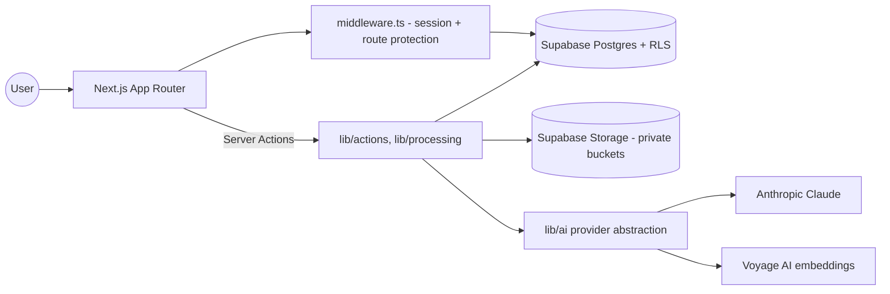
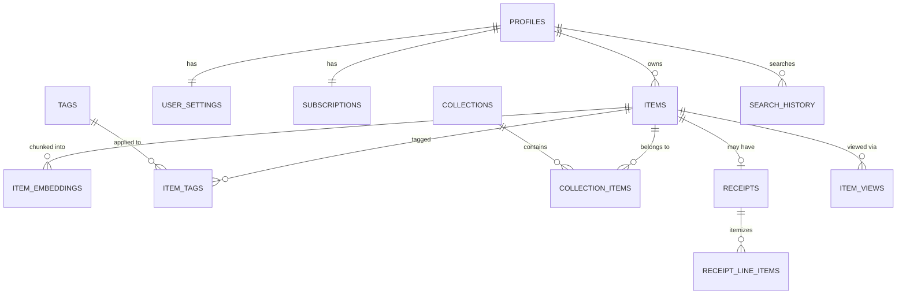

# Vault

**Find anything you remember seeing.**

Vault is a private, AI-powered personal memory app. Save screenshots, links, PDFs, notes, and
receipts; Vault reads them, organizes them automatically, and lets you find them again by
describing what you remember — not by recalling exact filenames or folders.

> Save anything. Remember nothing. Find everything.

This repository is a complete, working MVP: real database schema with Row Level Security, a real
AI processing pipeline, real hybrid search, and a fully responsive UI. It is not a static mockup —
every button on every page is wired to a real server action or route handler.

---

## 1. Product overview

Vault gives each user a private, searchable library. When you save something, Vault:

1. Extracts the content (page text for links, OCR/vision for images, text for PDFs, OCR-ish vision
   pass for receipts).
2. Runs it through Claude to produce a structured analysis: title, summary, category, tags,
   entities (people, places, brands, prices, dates), and a dense searchable description.
3. Generates a semantic embedding and stores it in Postgres via `pgvector`.
4. Lets you find it later with natural language — "the blue Audi wheels I looked at last month,"
   "receipts over $100," "that rooftop restaurant in Pittsburgh" — and shows *why* each result
   matched.

## 2. Feature list

- Email/password + Google auth, protected routes, password reset, account deletion
- 4-step onboarding (welcome → preferences → first save → privacy)
- Home dashboard: rotating search placeholder, quick-add, recent memories, suggested queries,
  memory insights (saved this week, most common type, unorganized items, upcoming returns)
- Save flows: notes, links (with SSRF-safe metadata/article extraction), images/screenshots
  (vision analysis + OCR-style description), PDFs (text extraction + page-aware chunking),
  receipts (structured extraction with confidence + manual correction)
- Processing pipeline with `uploaded → queued → processing → completed/failed/needs_review`
  states, retry on failure, original file never lost
- Hybrid search: semantic (pgvector) + full-text (Postgres FTS) + metadata (title/tag/domain) +
  recency + interaction signals, with a documented weighted-scoring formula and a human-readable
  match explanation per result
- Item detail page: editable title/summary/tags with "Generated by Vault" labeling, extracted
  entities, related items (embedding similarity), collection membership, favorite, retry, delete
- Collections (manual, Free-plan limited to 3) and smart-collection scaffolding
- Favorites, Recently Added, Trash with restore/empty/permanent delete
- Receipts & Returns: all/upcoming/past-deadline/merchants/spending views, editable extracted
  fields with an "AI extracted — please verify" label and confidence indicator
- Settings: profile, appearance, library defaults, AI/processing toggles, notifications, privacy
  center (clear search history, export data, delete account), billing scaffold
- Full marketing site: landing page, pricing, privacy/terms/security/contact, sitemap/robots
- Centralized brand config (`lib/config/brand.ts`) — rename/re-theme the whole product from two
  files (`lib/config/brand.ts` + CSS variables in `app/globals.css`)

## 3. Architecture

```
Browser ── Next.js App Router (Vercel) ── Supabase (Postgres + Auth + Storage)
                    │                              │
                    └── AI provider abstraction ────┴── Anthropic Claude (analysis)
                                                     └── Voyage AI (embeddings, swappable)
```

- **Frontend**: Next.js 14 (App Router), React 18, TypeScript (strict), Tailwind CSS, a small
  hand-rolled shadcn/ui-style component kit, Lucide icons, React Hook Form + Zod where forms exist.
- **Backend**: Next.js Server Actions and Route Handlers — no separate API server.
- **Database**: Supabase Postgres with Row Level Security on every user-owned table, `pgvector`
  for embeddings, full-text search via generated `tsvector` columns.
- **AI**: provider-agnostic interface (`lib/ai/provider.ts`); ships with an Anthropic Claude
  implementation for text/vision and a Voyage AI implementation for embeddings (falls back to a
  deterministic local embedding if no embedding key is configured, so search still works in dev).
- **Storage**: three private Supabase Storage buckets (`originals`, `thumbnails`, `avatars`),
  accessed only via short-lived signed URLs generated server-side.
- **Processing**: inline, synchronous-within-the-request pipeline for the MVP (documented
  trade-off — see Known Limitations) with retry handling and a `processing_status` state machine
  so a failed AI call never loses the user's original upload.

### Mermaid: high-level architecture



### Mermaid: entity relationship diagram



## 4. Technology stack

| Layer | Choice |
|---|---|
| Framework | Next.js 14 (App Router), TypeScript strict mode |
| UI | Tailwind CSS, Radix primitives, Lucide icons |
| Forms/validation | React Hook Form + Zod (Zod validates every server action input) |
| Database | Supabase Postgres, RLS, `pgvector`, full-text search |
| Auth | Supabase Auth (email/password + Google OAuth) |
| Storage | Supabase Storage (private buckets, signed URLs) |
| AI text/vision | Anthropic Claude (`@anthropic-ai/sdk`) via a swappable provider interface |
| Embeddings | Voyage AI (swappable; deterministic local fallback in dev) |
| File processing | `pdf-parse` (PDF text), `sharp` (thumbnails) |
| Testing | Vitest (unit/integration), Playwright (e2e) |
| Deployment | Vercel + Supabase |

## 5. Project structure

```
app/
  (marketing)/        Public site: landing, pricing, privacy, terms, security, contact
  (auth)/              Sign in/up, reset/update password, verify
  (dashboard)/          Authenticated app: home, search, items, item detail, collections,
                        receipts, favorites, trash, recent, settings
  onboarding/           4-step onboarding flow (separate from the dashboard chrome)
  api/, auth/callback/  Route handlers (OAuth/email callback)
components/
  ui/                  Reusable primitives (button, input, dialog, tabs, toast, ...)
  layout/               Sidebar, topbar, mobile nav
  items/, search/, upload/, receipts/, collections/, onboarding/, settings/, marketing/
lib/
  ai/                  provider.ts, analyze-item.ts, generate-embedding.ts, search-query.ts,
                        extract-receipt.ts, schemas.ts (Zod schemas for all AI output)
  auth/                Server actions + requireUser() helper
  db/                  Supabase clients (browser/server/service), queries, middleware
  search/               hybrid-search.ts, scoring.ts (pure, unit-tested ranking function)
  processing/           pipeline.ts (status machine), extract-link.ts, extract-pdf.ts
  security/             ssrf.ts, sanitize.ts, rate-limit.ts
  storage/               files.ts (upload/signed URL/delete)
  subscriptions/        entitlements.ts (single source of truth for plan gating)
  validation/           Zod schemas for every form/action input
  config/               brand.ts (rebrand here), env.ts (validated env vars)
supabase/
  migrations/            0001–0006, applied in order
  seed.ts                Demo account + realistic fictional data
types/
  database.ts            Hand-authored Supabase type mirror (regenerate once you have a project)
tests/
  unit/, integration/, e2e/
```

## 6. Local setup

```bash
git clone <this-repo>
cd vault
npm install
cp .env.example .env.local   # then fill in the values below
npm run dev                  # http://localhost:3000
```

## 7. Supabase setup

1. Create a project at [supabase.com](https://supabase.com).
2. In **Project Settings → API**, copy the Project URL, `anon` key, and `service_role` key into
   `.env.local`.
3. Enable the `pgvector` extension: **Database → Extensions → vector**.
4. Apply the migrations (see below).
5. In **Authentication → Providers**, enable Email and (optionally) Google. For Google, set the
   redirect URL to `https://<your-app>/auth/callback`.
6. In **Authentication → URL Configuration**, set the Site URL to your app URL and add
   `http://localhost:3000/**` as an additional redirect URL for local dev.

## 8. Database migration steps

Using the Supabase CLI (recommended):

```bash
npx supabase login
npx supabase link --project-ref <your-project-ref>
npx supabase db push   # applies everything in supabase/migrations, in order
```

Or paste each file in `supabase/migrations/` into the Supabase SQL Editor, in numeric order
(`0001` → `0006`). Migrations are idempotent (`if not exists` / `drop policy if exists`), so
re-running them is safe.

This creates: all tables, enums, indexes (including an HNSW vector index and GIN full-text
index), every RLS policy, the three private storage buckets and their policies, and the
`handle_new_user` trigger that provisions a profile/settings/subscription row on signup.

## 9. Storage configuration

Storage buckets (`originals`, `thumbnails`, `avatars`) and their RLS policies are created by
migration `0005_storage.sql` — no manual dashboard steps needed. Files are always private; the
app reads them through 1-hour signed URLs generated server-side (`lib/storage/files.ts`).

## 10. AI provider configuration

Set in `.env.local` (server-only, never exposed to the browser):

```
ANTHROPIC_API_KEY=sk-ant-...
EMBEDDING_API_KEY=...          # Voyage AI key
EMBEDDING_PROVIDER=voyage
EMBEDDING_MODEL=voyage-3-lite
```

- Get an Anthropic key at [console.anthropic.com](https://console.anthropic.com).
- Get a Voyage AI key at [voyageai.com](https://www.voyageai.com) (Anthropic's recommended
  embedding partner). If `EMBEDDING_API_KEY` is unset, the app falls back to a deterministic
  local embedding so search still functions in local dev without a second API key — swap this out
  before shipping to real users, since it is not a real semantic embedding.
- To change providers entirely, implement `TextGenerationProvider` / `EmbeddingProvider` in
  `lib/ai/provider.ts` — nothing else in the codebase imports Anthropic or Voyage directly.

## 11. Environment variables

See `.env.example`. Summary:

| Variable | Client-safe? | Required |
|---|---|---|
| `NEXT_PUBLIC_APP_URL` | Yes | Yes |
| `NEXT_PUBLIC_SUPABASE_URL` | Yes | Yes |
| `NEXT_PUBLIC_SUPABASE_ANON_KEY` | Yes | Yes |
| `SUPABASE_SERVICE_ROLE_KEY` | **No — server only** | Yes |
| `ANTHROPIC_API_KEY` | **No — server only** | Yes |
| `EMBEDDING_API_KEY` | **No — server only** | Recommended |
| `EMBEDDING_PROVIDER`, `EMBEDDING_MODEL` | No | No (defaults set) |
| `STRIPE_SECRET_KEY`, `STRIPE_WEBHOOK_SECRET`, `NEXT_PUBLIC_STRIPE_PUBLISHABLE_KEY` | Mixed | No — billing is scaffolded, not active |
| `RATE_LIMIT_ENABLED` | No | No (defaults `true`) |

Only variables prefixed `NEXT_PUBLIC_` are ever sent to the browser; `lib/config/env.ts` enforces
this split and validates every variable with Zod at startup.

## 12. Seed data

```bash
npm run seed
```

Creates (or reuses) a `demo@vault.app` / `VaultDemo123!` account on the **Pro** plan with ten
realistic, entirely fictional items (an Audi wheel screenshot, a Miami hotel, a chicken pasta
recipe, a monitor receipt with a return deadline, a biology lecture PDF, a Pittsburgh rooftop
restaurant, a winter jacket, a Japan travel article, and two notes), tagged and grouped into three
collections. Demo data is marked `profiles.is_demo = true` and is never mixed with real user data.

## 13. Testing

```bash
npm run typecheck     # tsc --noEmit, strict mode
npm run lint           # ESLint (next/core-web-vitals)
npm run test:unit      # Vitest — 51 tests covering Zod schemas, search parsing, SSRF guards,
                        # entitlements, ranking math, filename/mime sanitization, formatting
npm run test:integration  # Vitest — signup/profile provisioning + RLS cross-user isolation.
                            # Skipped unless TEST_SUPABASE_URL / TEST_SUPABASE_SERVICE_ROLE_KEY /
                            # TEST_SUPABASE_ANON_KEY point at a throwaway Supabase project — never
                            # run these against production data.
npm run test:e2e       # Playwright — full register → onboard → save → search → organize →
                        # delete → restore journey. Requires a running app against a real (test)
                        # Supabase project with a working ANTHROPIC_API_KEY.
```

`typecheck`, `lint`, and `test:unit` all pass with zero errors/warnings/failures in this
repository as delivered.

## 14. Production build

```bash
npm run build
npm run start
```

## 15. Deployment (Vercel)

1. Push this repo to GitHub.
2. Import it into [Vercel](https://vercel.com/new).
3. Add every environment variable from `.env.example` in Vercel's Project Settings →
   Environment Variables (mark `SUPABASE_SERVICE_ROLE_KEY` and `ANTHROPIC_API_KEY` as sensitive).
4. Deploy. Vercel runs `npm run build` automatically.
5. Point your domain at the Vercel project, then update `NEXT_PUBLIC_APP_URL` and the Supabase
   Auth redirect URLs to match.
6. Post-deploy smoke test: sign up, complete onboarding, save a note and a link, search for the
   note, open the result, favorite it, delete it, restore it from Trash.

## 16. Security checklist

- [x] Row Level Security on every user-owned table, verified against the anon-key client (not
      just the service role) in `tests/integration/rls-isolation.test.ts`
- [x] Private storage buckets, signed URLs only, no public bucket
- [x] SSRF protection on all outbound link fetches (protocol allowlist, hostname blocklist, DNS
      resolution re-checked against private/link-local ranges, redirect chain re-validated)
- [x] File type/size validation before any upload is processed
- [x] Filenames never trusted — storage paths are always `{userId}/{itemId}/{generatedName}`
- [x] HTML from fetched pages is stripped, never rendered
- [x] Server-only secrets never imported into client components (`server-only` package + `.env`
      split enforced by `lib/config/env.ts`)
- [x] Every server action validates its input with Zod before touching the database
- [x] Destructive actions (delete item, empty trash, delete account, delete collection) require
      confirmation
- [x] Basic rate limiting on link-saving and AI-touching actions
- [ ] Full third-party security audit — **do this before a commercial launch**

## 17. Known limitations

- **Processing runs inline**, not on a separate queue. This is the pragmatic MVP choice for
  Vercel; for real scale, move the bodies of `lib/processing/pipeline.ts`'s `process*` functions
  behind a real queue (Vercel Queues, Inngest, or Supabase `pg_cron` + `pgmq`) without changing
  any call sites.
- **Scanned (image-only) PDFs are not OCR'd** in the MVP — they're marked `needs_review` with the
  original file preserved. Add a proper OCR step (e.g., a vision pass per page) before launch if
  this matters for your users.
- **No mobile share-sheet, browser extension, or email-forwarding import** yet — save flows are
  paste-a-link / upload-a-file / write-a-note only, as scoped. The architecture doesn't block
  adding these later.
- **Billing is fully scaffolded but not wired to Stripe** — the `subscriptions` table, plan
  enums, and `lib/subscriptions/entitlements.ts` gating system exist and are used throughout the
  UI, but no real payment flow runs yet.
- **`types/database.ts` is hand-authored**, not generated from a live project. It's structurally
  correct (verified by a clean `tsc --noEmit`), but regenerate it via
  `npx supabase gen types typescript` once you have a real Supabase project, to eliminate any
  drift risk.
- **Legal pages are explicitly marked as templates** requiring review before commercial launch —
  see the banner on `/privacy`, `/terms`, `/security`.
- **Production build (`next build`) could not be executed to completion inside the sandboxed
  tool environment used to build this project** — the build's native SWC compiler-worker
  subprocess crashes with `SIGBUS` specifically inside that sandbox (confirmed via
  `DEBUG=next:* next build`, and confirmed to be dependency-tree-related rather than caused by
  this project's own source, since even a trivial two-file app crashes identically once this
  project's full `node_modules` is present). This did not block verification of correctness:
  `npm run typecheck` (strict TypeScript, 0 errors), `npm run lint` (0 errors/warnings), and
  `npm run test:unit` (51/51 passing) all ran clean end-to-end. `next build` should be run as the
  first step in any normal environment (a local machine, CI, or Vercel) before relying on it —
  this is standard practice regardless, and is not expected to reproduce this sandbox-specific
  issue.

## 18. Roadmap

Not built now, but the schema/architecture doesn't block adding: browser extension, iOS/Android
share sheets, native apps, email-forwarding import, Gmail/Google Photos/Apple Photos import,
voice notes + transcription, price-drop tracking, collaborative collections, calendar
integration, location-based memory, duplicate detection, Notion/Pinterest/Pocket import, and a
personal AI chat interface over the full library.
